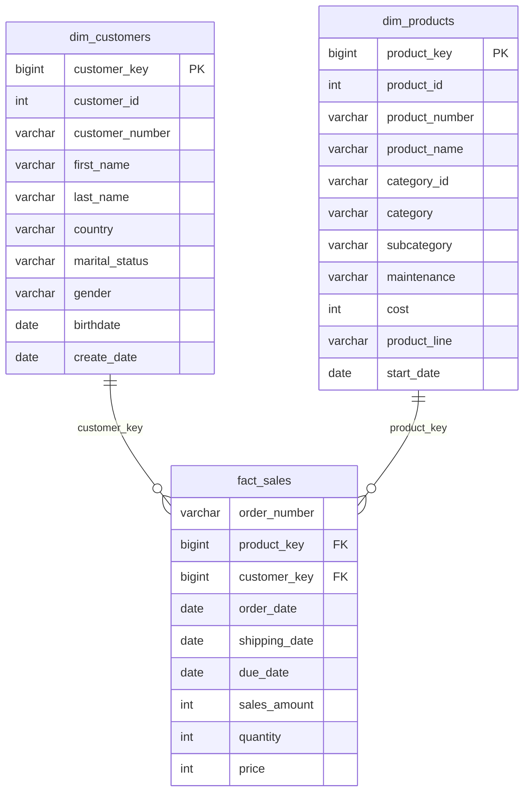

# Retail Sales Data Warehouse (PostgreSQL)

An end-to-end data warehouse that ingests two operational source systems, standardizes and integrates them into a single trusted dataset, and models the result as a **star schema** ready to serve a BI tool such as Power BI.

Built on the **Medallion architecture** — raw ingestion (Bronze), cleansing and standardization (Silver), and a business-ready dimensional model (Gold).

> **About this project.** A portfolio project built on a public dataset, following the data warehouse design from [DataWithBaraa's SQL Data Warehouse Project](https://github.com/DataWithBaraa/sql-data-warehouse-project) and **re-implemented from SQL Server to PostgreSQL**. The layered architecture and transformation logic follow that reference; the PostgreSQL implementation is my own — every DDL, load, and transformation script was rewritten for Postgres (`BULK INSERT` → `COPY`, integer-to-date parsing via `TO_DATE`, `ISNULL`/`LEN`/`GETDATE` → `COALESCE`/`LENGTH`/`CURRENT_DATE`, dependency-aware view build order), and the pipeline was built and run on macOS in VS Code. This is not production or company data.

---

## What this project demonstrates

This project was built to practise the core responsibilities of a **BI / data warehouse analyst** who owns a warehouse and its reporting layer:

- **Owning a data warehouse end to end** — from raw source files to a governed, query-ready model, organized in clear architectural layers.
- **Extracting from multiple source systems and standardizing into one dataset** — consolidating a CRM and an ERP feed, resolving their inconsistencies, and aligning their keys so they can be joined.
- **Dimensional modeling as a BI-ready semantic foundation** — a star schema (surrogate keys, conformed dimensions, a central fact) that a Power BI model connects to directly.
- **A design that extends to further sources and channels** — the layered structure lets a new source be added as another Bronze feed without disturbing the model downstream.

---

## Architecture

The warehouse is organized into three layers, each a PostgreSQL schema. The separation is deliberate: it makes the pipeline traceable (you can see data at every stage), re-runnable (any layer can be rebuilt from the one before it), and keeps each concern in one place.

### Bronze — raw landing zone
Source CSVs are loaded **exactly as received**, with no cleaning. Column types mirror the source, including dates stored as integers (e.g. `20101229`). Keeping this layer faithful means ingestion never fails on messy values and all cleaning logic lives in exactly one place downstream.

### Silver — cleansed and standardized
This is where raw data becomes trustworthy. Applied here:

- **Deduplication** — the same customer appearing multiple times is reduced to the most recent record, using a window function (`ROW_NUMBER` partitioned by customer id, ordered by create date).
- **Date standardization** — integer-encoded dates are parsed into real `DATE` values; impossible values (`0`, wrong length, future birthdates) are nulled rather than allowed through.
- **Value decoding** — cryptic codes become readable: gender `M`/`F` → `Male`/`Female`, marital status `S`/`M` → `Single`/`Married`, product-line and country codes expanded, unknowns standardized to `n/a`.
- **Business-rule enforcement** — the sales line rule `sales = quantity × price` is enforced; where the source value is missing or inconsistent, it is recalculated, and unit price is re-derived where invalid.
- **Cross-system key alignment** — ERP identifiers are reshaped (prefix stripped, separators removed) so they match the CRM keys. This is what makes integrating the two systems possible.
- **Derivation** — a `category_id` is extracted from the product key so products can be joined to the category lookup.
- **Lineage** — every Silver row carries a `dwh_create_date` load timestamp.

### Gold — business-ready star schema
The cleaned data is modeled into two dimensions and one fact, exposed as SQL **views** over Silver. Each dimension is given a **surrogate key** (a warehouse-generated id, independent of volatile source ids), and the fact table references those keys — the exact structure a BI semantic model expects.

---

## Key engineering decisions (and why)

- **Views for the Gold layer, not tables.** Gold views read live from Silver, so the model is always in sync and consumes no extra storage. At this data volume the recompute cost is negligible; the trade-off would be revisited at larger scale.
- **Surrogate keys in dimensions.** The fact table joins on warehouse-generated keys rather than source business ids, so the model is insulated from changes or inconsistencies in the source systems.
- **Source-of-truth resolution.** Where CRM and ERP disagree on gender, CRM is treated as authoritative and ERP is used only as a fallback — an explicit data-governance rule rather than an arbitrary pick.
- **Cleaning isolated to Silver.** Bronze stays raw on purpose; every transformation is auditable in one layer, which is what makes the pipeline defensible.

---

## Star schema (Gold layer)



`fact_sales` is the centre of the star; each sales line joins to `dim_customers` and `dim_products` through surrogate keys. GitHub renders this diagram automatically.

---

## Tech stack

- **PostgreSQL** — warehouse database
- **SQL** — DDL, ETL, and star-schema views
- **VS Code** (PostgreSQL extension) on **macOS** — development environment
- **Power BI** — intended consumer of the Gold layer (see Roadmap)

---

## Data sources

Two source systems, provided as CSV files:

- **CRM** — customer information, product information, sales details
- **ERP** — customer demographics (birthdate, gender), location (country), product category hierarchy

---

## Repository structure

```
sql-data-warehouse-postgres/
├── README.md
├── datasets/
│   ├── source_crm/
│   └── source_erp/
├── docs/
│   └── data_catalog.md        # Column-level documentation of the Gold layer
└── scripts/
    ├── init_database.sql      # Create database + bronze/silver/gold schemas
    ├── bronze/
    │   ├── ddl_bronze.sql
    │   └── load_bronze.sql
    ├── silver/
    │   ├── ddl_silver.sql
    │   └── load_silver.sql
    └── gold/
        └── ddl_gold.sql
```

## How to run

Run against a PostgreSQL instance from the project root, in order (each layer depends on the previous one):

1. `scripts/init_database.sql` — create the database and the three schemas
2. `scripts/bronze/ddl_bronze.sql` — create the six raw tables
3. `scripts/bronze/load_bronze.sql` — load the source CSVs into Bronze
4. `scripts/silver/ddl_silver.sql` — create the six cleaned tables
5. `scripts/silver/load_silver.sql` — transform Bronze into Silver
6. `scripts/gold/ddl_gold.sql` — create the star-schema views

Verify row counts at each layer, and confirm every `fact_sales` row resolves to a customer and product (no orphan surrogate keys) before connecting a BI tool.

---

## Roadmap

The Gold layer is purpose-built as the semantic foundation for a BI model. The planned next phase:

- **Power BI semantic model** over the three Gold views — relationships on the surrogate keys, a dedicated date dimension for time intelligence, and core DAX measures (Total Sales, Total Orders, Average Order Value).
- **Report templates** — an overview page plus product and customer views, built to defined reporting requirements.
- **Additional source channels** — extending the pipeline by adding new source feeds at the Bronze layer and conforming them into the existing model.

---

## Documentation

- [`docs/data_catalog.md`](docs/data_catalog.md) — column-level documentation of every Gold view, with grain and source lineage.

## Credit

Data warehouse design and dataset from [DataWithBaraa's SQL Data Warehouse Project](https://github.com/DataWithBaraa/sql-data-warehouse-project). PostgreSQL re-implementation by Nhu Xuan Anh Nguyen.
